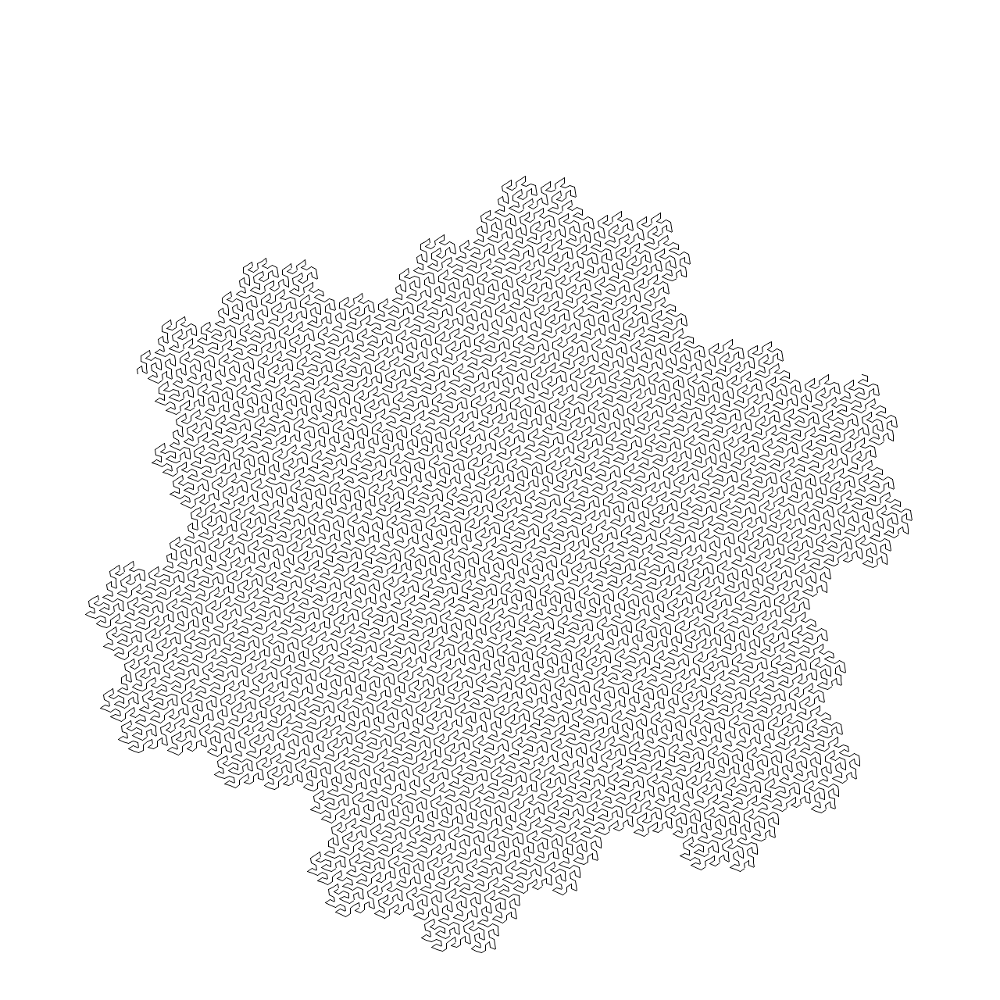

# Gosper Curve implemented in Rust

This repository contains a simple pet project in Rust that generates
Gosper curves, that are recursive space filling curves.

Run `cargo run` to build and run program.

Program is run without argument and creates a list of PNG images that
illustrate the recursive creation of the fractal.

It uses [plotters](https://github.com/38/plotters) library to generate PNG images.

A Python implementation is also available
[here](https://github.com/Gjacquenot/GosperCurve).

